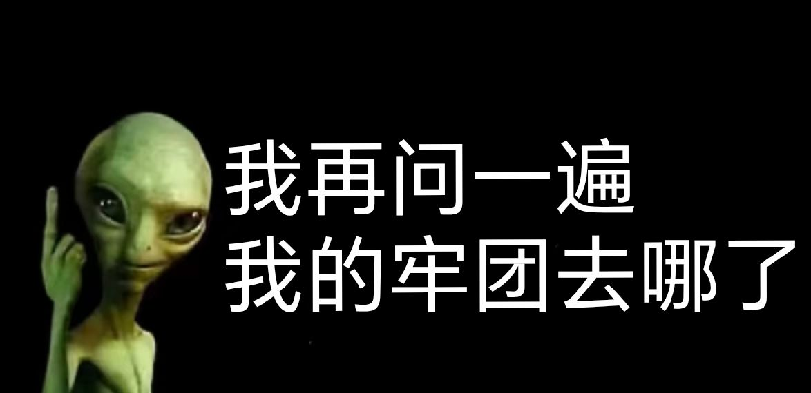
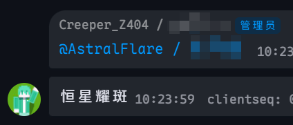
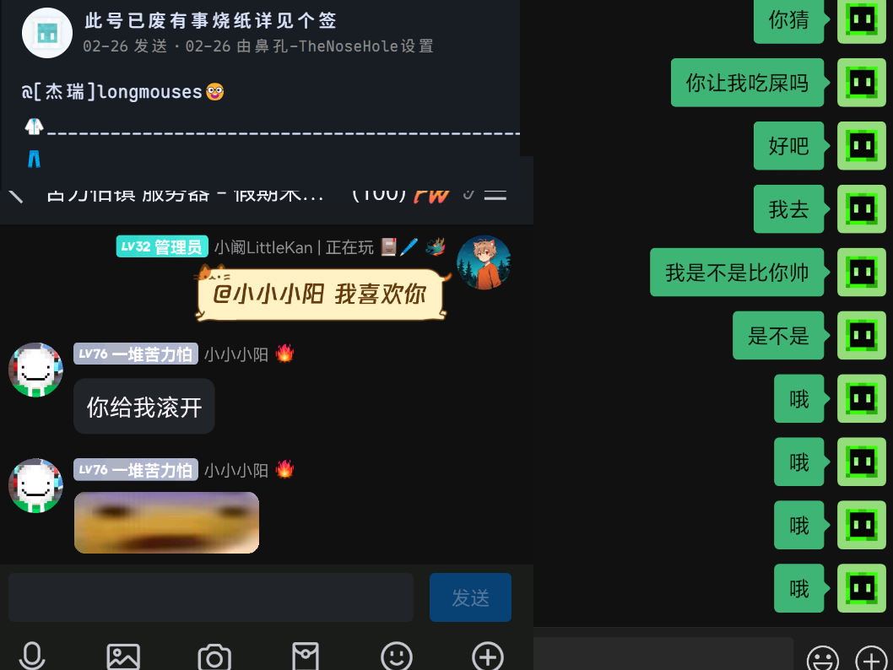
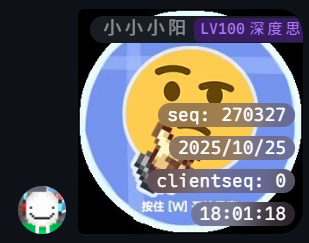

# 你服特有的梗

由社区维护的 CTMC 梗百科。右侧目录查阅你要寻找的梗，或按 `F3` 打开查找页面搜索。

## 牢团(？)

.png)

**有关人物：** 小小小阳、Astral✦Flare

此梗来源于小阳在群中曾说过的一句话：**“牢团你怎么改名字了”**。

Astral✦Flare 曾名团子，改名后引起该群员困惑，后该群员将此梗变成了某种保留节目。

常见于小阳当日第一次看到 Astral✦Flare 发言时。内容大致类似于 **“牢团你怎么改名字了(？)”“牢团你怎么(？)”“牢团(？)”**

后续：**“我再问一遍我的牢团去哪了.jpg”**

## 恒星耀斑/太阳耀斑

**有关人物：** Creep、Astral✦Flare

Astral✦Flare 刚改名时，Creep 使用 QQ 翻译和必应翻译分别将其机翻为 **“恒星耀斑”“太阳耀斑”**，此梗由此而来。

## 精神病三人组

**有关人物：** Creep、小阚、Astral✦Flare

这仨实在是有点大病了，自己看图吧。

## 深度思索

**有关人物：** 小小小阳

小阳喜欢发一个 **“按住 [W] 开始思索”** 的表情，故得头衔“深度思考中”。